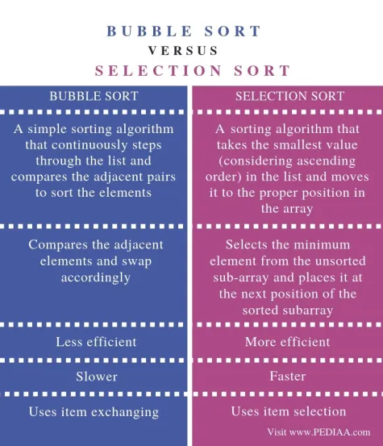
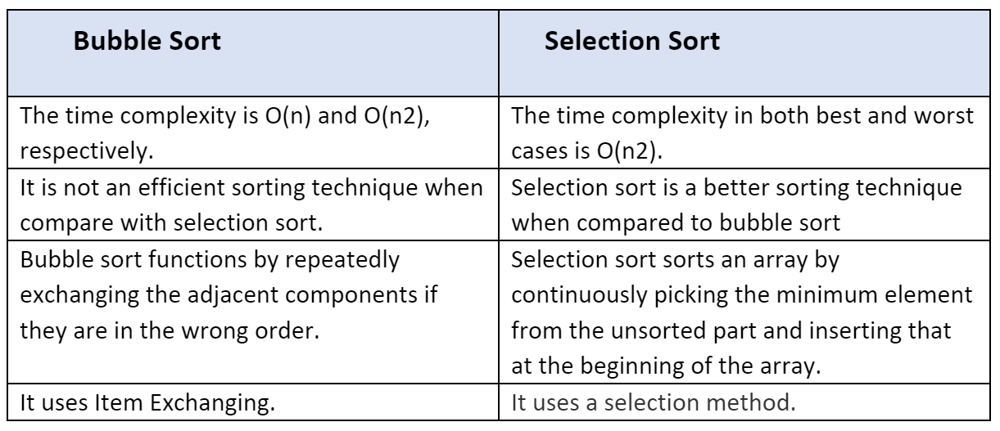

Bubble sort involves comparing and potentially swapping two adjacent elements. If the elements are in the correct order, we move to the next pair. Selection sort involves finding the smallest element in the list and swapping it with the first element in the unsorted portion of the list.

Bubble Sort:
Idea: Bubble sort works by repeatedly swapping adjacent elements if they are in the wrong order. It moves the largest unsorted element to its correct position in each pass.
Implementation: The algorithm iterates over the array multiple times, comparing adjacent elements and swapping them if they are in the wrong order.

Selection Sort:
Idea: Selection sort works by repeatedly finding the minimum element from the unsorted part of the array and putting it at the beginning. It divides the array into two parts: sorted and unsorted.
Implementation: The algorithm scans the array, finds the minimum element, and swaps it with the element at the beginning of the unsorted portion of the array.